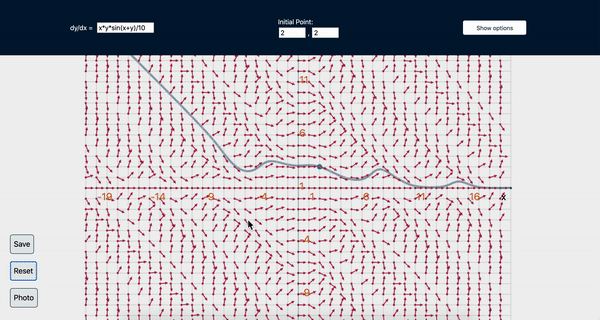

# Direction field apps

There are six apps, all are available at
[jesseburke.org/apps/differential-equations-apps](https://jesseburke.org/differential-equations-apps). 

We describe one such app in detail:

## Direction field grapher

Graphs the direction field of a first order differential equation.

[jesseburke.org/apps/differential-equations-apps/App-df/](https://jesseburke.org/differential-equations-apps/App-df/). 


### Features

- 3d view: the more vertical an arrow is, the more it is displaced in the z-direction. To see this, rotate the camera by holding shift while dragging the mouse, or or using two fingers on a touch screen (to move the display without rotating, use normal click and drag, or one finger on touch screen; to zoom in/out use pinch on a track pad or touch screen)



- everything is adjustable and customizable using the Options menu


- save the entire state of the app in the query string of the address (no server required); user can copy the new address, and e.g., send it to students, or post it on course webpages; also allows creation of easy defaults; once saved, the back button changes the app to the previously saved state.

- the initial point on the solution curve is draggable


## Implementation details

### Structure


 The libraries
[@jesseburke/three-scene-with-react](https://github.com/jesseburke/three-scene-with-react)
and
[@jesseburke/jotai-data-setup](https://github.com/jesseburke/jotai-data-setup)
are used.

The program is structured as follows:

The entire page and program is a single React component named App,
with the following structure, which is explained further below:
```javascript
function App() {
    return (
        <JotaiProvider>
                <header>
		    <DiffEqInput />
                    <InitialPointInput />
		    <OptionsModal />
                </header>

                <main>
                    <ThreeSceneComp>
                        <Axes2D/>
                        <Grid/>
                        <ArrowGrid/>
                        <IntegralCurve/>
                        <CameraControls/>
                    </ThreeSceneComp>
                    <DataComp/>
                </main>
        </JotaiProvider>
    );
}
```

